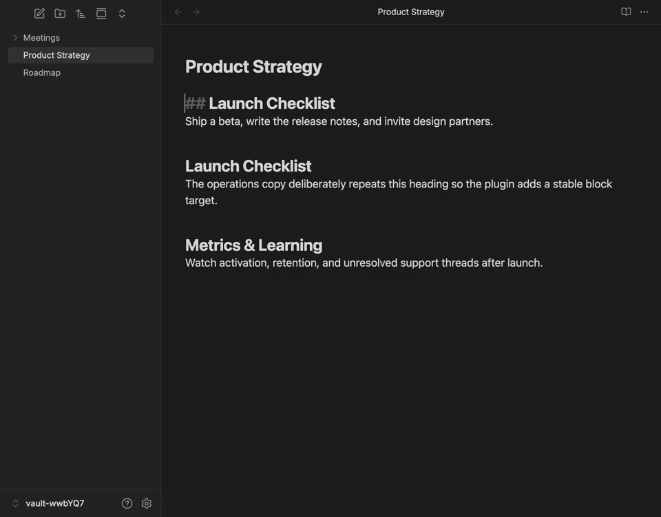
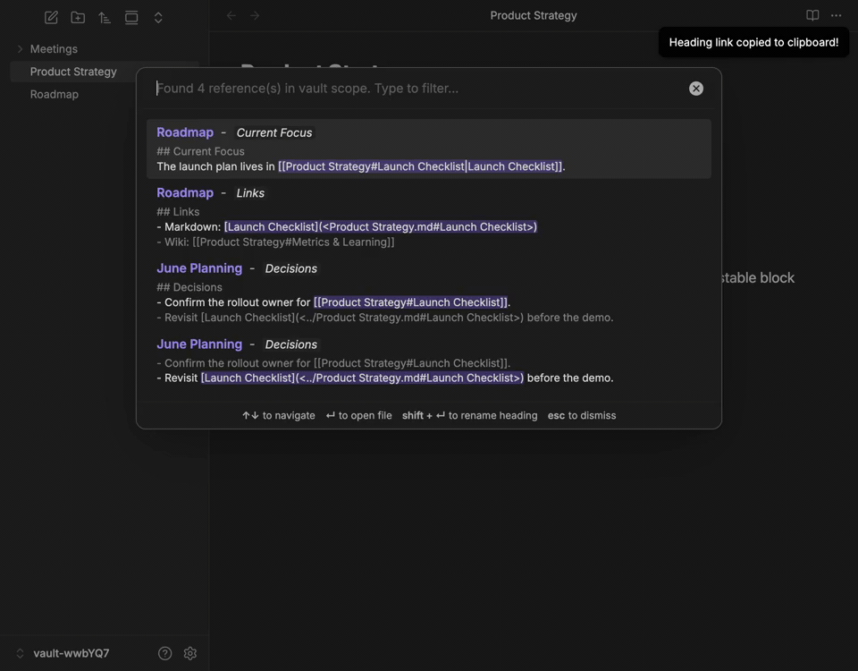
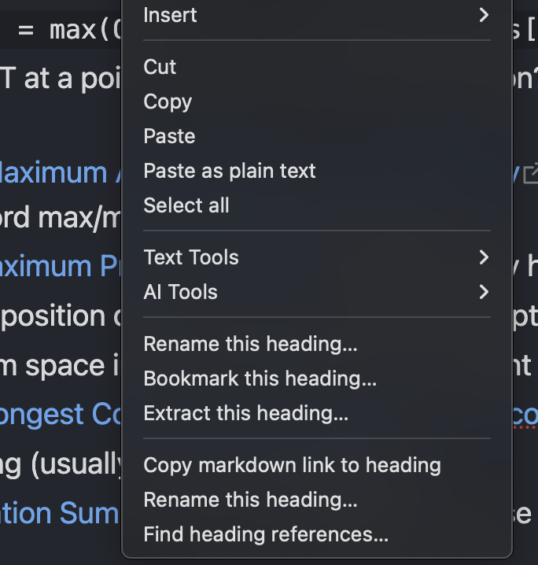
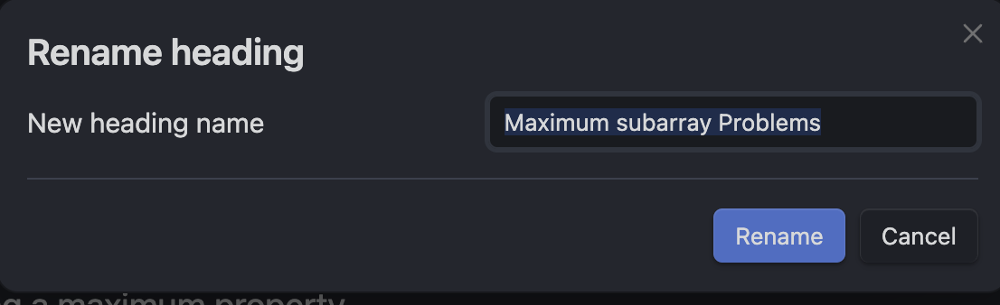
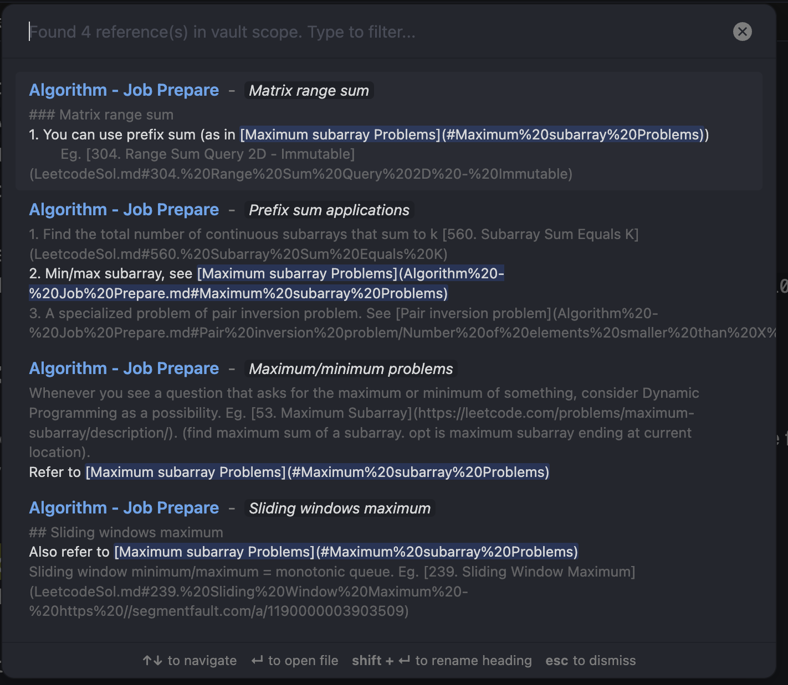
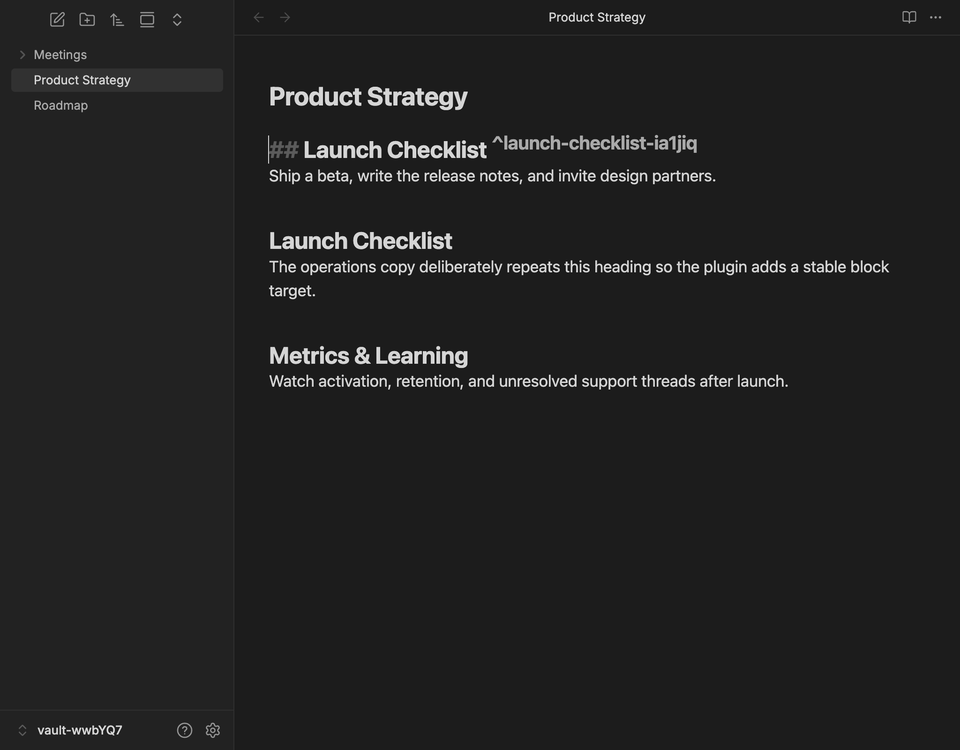
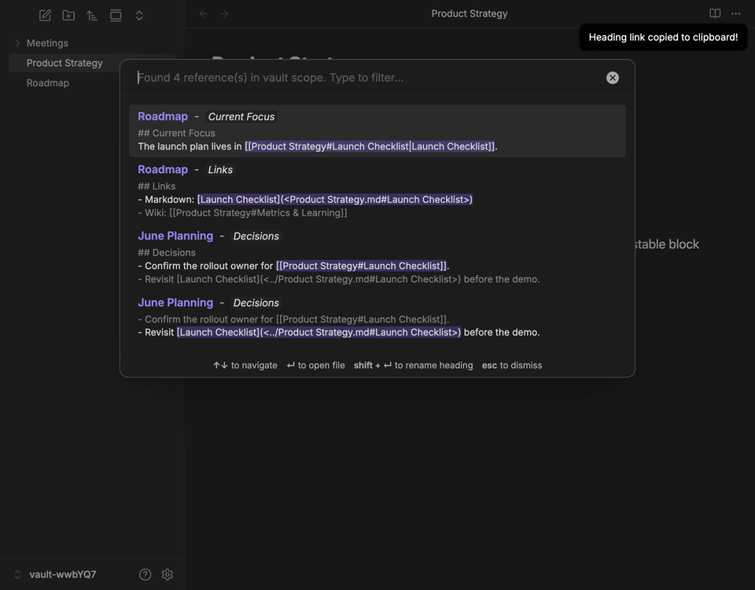
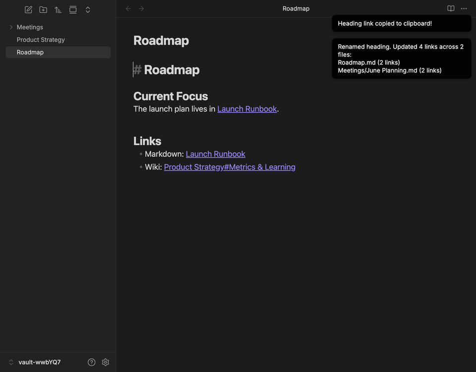

# Heading Linker and Refactor

   

**Supercharge your Obsidian headings!** Easily copy robust markdown links to any heading, find all references, and safely rename headings across your entire vault.

## Why this plugin?

As your vault grows, headings become powerful anchors for your thoughts. But Obsidian's native heading links can break if you rename them, and finding where a heading is used can be tedious. 

**Heading Linker and Refactor** solves this by providing a suite of advanced tools right in your editor's context menu.

## ✨ Features

- 🔗 **Smart Linking**: Right-click any heading to copy a markdown link to it. If you have duplicate headings in the same file, the plugin automatically generates and inserts a stable target. Obsidian block IDs (e.g., `^heading-id`) are the default, with HTML anchors (e.g., `<a id="...">`) available as a web/export compatibility option.
- 📝 **Safe Renaming**: Right-click a heading and select "Rename this heading...". The plugin will safely rename the heading and instantly update every single link pointing to it (Wiki, Markdown, and HTML links) across your file, folder, or entire vault. It even intelligently updates display aliases that match the old heading name.
- 🔎 **Find References**: Need to know everywhere a heading is mentioned? Click "Find heading references..." to open a beautifully formatted search modal. See the exact context of each mention and jump straight to the source.
- ⚡ **Lightning Fast Refactor**: Press `Shift + Enter` right inside the "Find References" modal to instantly rename the heading and all its references across your vault!
- ⚙️ **Customizable Settings**: Choose between relative or full vault link paths, and configure the default scope for renaming headings (Entire Vault, Current Folder, or Current File).
- ⌨️ **Keyboard Shortcuts (Hotkeys)**: Bind custom keyboard shortcuts for all three commands (Copy, Rename, and Find References) that trigger only when editing a heading line!

## See it in action

### Copy resilient links, even for duplicate headings

When a heading name appears more than once in the same note, the plugin automatically adds a stable block target and copies a link that will keep working after nearby text changes.



### Find references and rename safely across the vault

Search every note that points at a heading, jump through the matches, then rename the heading and update wiki links, markdown links, and matching aliases in one pass.



## 🛠️ How to Use

1. Open any markdown file in Obsidian.
2. Right-click on any heading in the editor to open the context menu.



3. Choose one of the new options:
   - **Copy markdown link to heading**: Instantly copies a reliable markdown link to your clipboard.
   
   - **Rename this heading...**: Opens a modal to safely rename the heading across your entire vault.
   
   <br>
   
   
   - **Find heading references...**: Opens a beautifully formatted search modal to see the exact context of each mention and jump straight to the source.
   
   <br>
   

## Workflow screenshots

<table>
  <tr>
    <td width="50%">
      
    </td>
    <td width="50%">
      
    </td>
  </tr>
  <tr>
    <td align="center"><strong>Stable targets</strong><br>Duplicate headings get reliable link anchors automatically.</td>
    <td align="center"><strong>Reference search</strong><br>Matches show file names, surrounding context, and highlighted links.</td>
  </tr>
  <tr>
    <td colspan="2">
      
    </td>
  </tr>
  <tr>
    <td colspan="2" align="center"><strong>Vault-wide rename</strong><br>After a rename, linked notes are updated with the new heading destination and matching display text.</td>
  </tr>
</table>

## Link Generation and Reference Matching

### Generated markdown links

When you copy a link to a unique heading, the plugin uses the visible heading text as the Obsidian heading fragment and wraps the markdown destination in angle brackets. This is standard markdown syntax for link destinations that contain spaces or parentheses, and it lets Obsidian resolve the raw heading text directly.

For example, this heading:

```md
## $O(n \cdot 2^n)$ solution
```

copies as:

```md
[$O(n \cdot 2^n)$ solution](<./Algorithms.md#$O(n \cdot 2^n)$ solution>)
```

The path portion follows the **Link Path Format** setting:

- Basename mode uses `./FileName.md`.
- Full vault path mode uses the full vault path, such as `folder/FileName.md`.

If multiple headings in the same file have the same visible text, the plugin inserts or reuses a stable target marker instead of linking to the ambiguous heading text. By default it uses an Obsidian block ID:

```md
## Duplicate heading ^duplicate-heading-a1b2c3
[Duplicate heading](<./Note.md#^duplicate-heading-a1b2c3>)
```

If the duplicate target format is set to HTML anchors, it uses an anchor ID instead:

```md
## Duplicate heading <a id="duplicate-heading-a1b2c3"></a>
[Duplicate heading](<./Note.md#duplicate-heading-a1b2c3>)
```

### Special characters in headings

Headings often contain characters that are meaningful to markdown or wikilink syntax. Generated links escape them so the link stays valid **and** remains findable and renamable later:

- Brackets `[` and `]` are escaped in the link label (for example, the heading `A [x]` copies as `[A \[x\]](<./Note.md#A [x]>)`).
- Angle brackets `<` and `>` are escaped inside the wrapped destination (for example, `#A \< B \> C`).
- Backslashes are escaped in the label.

These links round-trip correctly: **Find heading references...** and **Rename this heading...** detect them and update both the destination and a display label that matches the old heading name.

> [!NOTE]
> When **renaming** a heading, the new name cannot contain `|`, `]`, or line breaks. Obsidian wikilinks (`[[Note#Heading|alias]]`) have no way to escape these characters, so the rename modal rejects such names with a notice rather than writing a broken link. You can still rename a heading that already contains them *to* a safe name.

### Finding heading references

When you choose **Find heading references...**, the plugin scans markdown files in the selected scope and matches the heading by visible text and by any stable target IDs on the heading line.

For heading-text links, it recognizes Obsidian wikilinks:

```md
[[Algorithms#$O(n \cdot 2^n)$ solution]]
[[Algorithms#$O(n \cdot 2^n)$ solution|custom label]]
```

It also recognizes markdown links with raw wrapped destinations, percent-encoded destinations, and space-only encoded destinations:

```md
[$O(n \cdot 2^n)$ solution](<Algorithms.md#$O(n \cdot 2^n)$ solution>)
[$O(n \cdot 2^n)$ solution](Algorithms.md#%24O%28n%20%5Ccdot%202%5En%29%24%20solution)
[$O(n \cdot 2^n)$ solution](Algorithms.md#$O(n%20\cdot%202^n)$%20solution)
```

For stable duplicate-heading targets, it recognizes wiki, markdown, and HTML links that point to either `#id` or `#^id`, depending on the target format:

```md
[[Note#^duplicate-heading-a1b2c3]]
[Duplicate heading](<Note.md#^duplicate-heading-a1b2c3>)
<a href="Note.md#duplicate-heading-a1b2c3">Duplicate heading</a>
```

## ⚙️ Configuration & Hotkeys

### Keyboard Shortcuts (Hotkeys)
By default, the plugin registers commands without default keyboard shortcuts so they don't conflict with your existing setup. You can assign your own custom shortcuts in Obsidian:
1. Open Obsidian **Settings** and navigate to **Hotkeys**.
2. Search for `Heading Linker and Refactor`.
3. Click the blank button next to a command to record a key combination for:
   - `Copy Markdown Link`
   - `Rename this Heading`
   - `Find Heading References`
   - `Convert Heading Link Target Format`

> [!NOTE]
> To prevent accidental triggers, these keyboard shortcuts are context-sensitive. They will **only trigger when your cursor is positioned directly on a heading line**. If you press the shortcut while the cursor is anywhere else in the document, the command will silently do nothing.

### Settings Tab
Navigate to **Settings > Heading Linker and Refactor** to customize the default behavior:
- **Link Path Format**: Choose whether generated links use the target file basename (`./filename.md`) or full vault path (`folder/filename.md`).
- **Duplicate Heading Target Format**: Choose whether duplicate headings use Obsidian block IDs (`^id`) or HTML anchors (`<a id="...">`).
- **Rename Scope**: Set the default search scope when renaming a heading (search and replace in the **Entire vault**, **Current folder only**, or **Current file only**).

> [!NOTE]
> Obsidian block IDs are the default because Obsidian's internal note links jump to headings or block references, not arbitrary HTML `id` attributes. A link like `Note.md#my-html-id` may work after the note is rendered on the web, but it will not reliably jump to `<a id="my-html-id"></a>` inside Obsidian. Use HTML anchors only when exported or web-rendered Markdown compatibility matters more than Obsidian-native navigation.

## 📥 Installation

### From Obsidian Community Plugins
You can install this plugin directly from the Obsidian Community Plugins store:
[Heading Linker and Refactor](https://community.obsidian.md/plugins/heading-link-copy)

### Manual Installation
1. Download the latest release (`main.js`, `manifest.json`, and `styles.css`) from the [Releases](https://github.com/wilmtang/obsidian-heading-linker/releases) page.
2. Create a folder named `obsidian-heading-linker` in your vault's `.obsidian/plugins/` directory.
3. Place the downloaded files in that folder.
4. Restart Obsidian, go to **Settings > Community Plugins**, disable "Safe Mode", and enable **Heading Linker and Refactor**.

## 💻 Development

Want to contribute or build it yourself? 

```bash
npm install
npm run build
```

### Useful scripts

- `npm run dev`: Rebuilds `main.js` whenever `main.ts` changes.
- `npm run build`: Bundles the plugin entrypoint into `main.js`.
- `npm test`: Runs focused unit tests for link detection and rewrite behavior.
- `npm run test:integration`: Runs workflow tests against fake Obsidian app, vault, file, and editor services.
- `npm run test:e2e`: Launches a sandboxed desktop Obsidian instance through WebdriverIO and tests the packaged plugin in a real vault.
- `npm run check:versions`: Verifies `manifest.json` and `package.json` use the same version, and that `versions.json` maps that version to the manifest's `minAppVersion`.
- `npm run typecheck`: Runs TypeScript validation without emitting files.
- `npm run typecheck:e2e`: Runs TypeScript validation for the WebdriverIO Obsidian e2e config and specs.
- `npm run lint:obsidian`: Runs the local Obsidian release linter checks.
- `npm run check:release`: Runs version consistency, typecheck, Obsidian linting, unit tests, and build; use this before creating a GitHub release or uploading a new version to the Obsidian store.

### Release automation

GitHub Actions runs `npm run check:release`, `npm run typecheck:e2e`, and `xvfb-run -a npm run test:e2e` on every branch push. This catches version drift, TypeScript, Obsidian linter, unit test, build, and real Obsidian/WebdriverIO problems before anything is published.

The release process uses `manifest.json` as the source of truth. When the `version` field changes on the default branch, the workflow:

1. Runs the Obsidian release checks.
2. Creates and pushes a matching git tag if one does not already exist.
3. Creates a GitHub release named after the manifest version with `main.js`, `manifest.json`, `versions.json`, and `styles.css`.

If the workflow cannot compare the current manifest version with the previous commit, it skips release creation instead of guessing. Bump `manifest.json` again on the default branch to start a release.

---
*Built with ❤️ for the Obsidian Community.*
